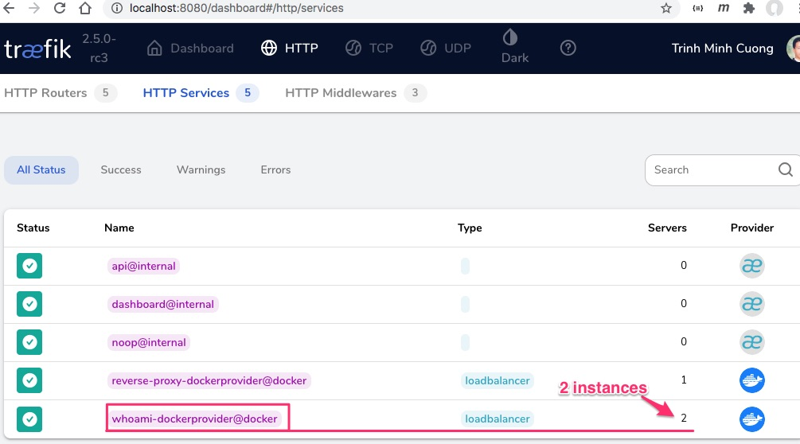

# Traefik cấu hình bằng File Provider và Docker Provider

Ở file [FileProvider](../FileProvider), chúng ta thấy nhược điểm của File Provider là không tương tác tốt với Container Ochestration như Docker. Khi tôi dùng Docker compose để scale whoami thành 2 instance nhưng Traefik chỉ có thể chuyển request đến instance đầu tiên.

Trong bài này, tôi đề xuất kết hợp File Provider và Docker Provider.

Hỏi: Tại sao vẫn phải dùng File Provider để cấu hình trong khi Docker Provider linh hoạt hơn?

Đáp: File Provider tuy không cập nhật được danh sách các service đang biến động trong hệ thống nhưng nó viết ở dạng script YAML hoặc TOML rất tường minh. Ví dụ tôi muốn định nghĩa một luật chọn request phức tạp, sau đó chuyển request qua một  middle ware để xử lý ví dụ như xác thực Basic Authentication, rồi mới chuyển đến service.


## Chạy thử

```
docker-compose up -d
```

mở trình duyệt vào địa chỉ `http://localhost/whoami` ấn refresh mỗi lần sẽ thấy nội dung khác
```
Hostname: 4bb536d8d229
IP: 127.0.0.1
IP: 172.24.0.3
```
hoặc
```
Hostname: 808f274b6989
IP: 127.0.0.1
IP: 172.24.0.2
```

## Chỉnh sửa docker-compose.yml
Tôi bổ xung map volumes `/var/run/docker.sock:/var/run/docker.sock`

```yaml
version: '3'

services:
  reverse-proxy:
    image: traefik:v2.5
    ports:      
      - "80:80"
      - "8080:8080"
    volumes:
# map volume với /var/run/docker.sock để Traefik lắng nghe biến động từ Docker host
      - /var/run/docker.sock:/var/run/docker.sock
      - $PWD/traefik.yml:/traefik.yml
      - $PWD/traefik_dynamic.yml:/traefik_dynamic.yml

  whoami:
    image: traefik/whoami
    scale: 2 # Scale 2 service
```

## Chỉnh sửa traefik.yml
Thêm dòng `docker: {}` vào dưới thuộc tính `providers:`. Việc này cùng với thêm `/var/run/docker.sock:/var/run/docker.sock` ở docker-compose.yml giúp cho Traefik tương tác với Docker ochestration theo thời gian thực.

```yaml
entryPoints:
  web:
    address: :80

providers:
  docker: {}  # Bổ xung thêm docker là provider
  file:
    filename: /traefik_dynamic.yml
api:
  insecure: true
```

## Chỉnh sửa traefik_dynamic.yml

Bản cũ ở File Provider

```yaml
http:
  routers:
    # Define a connection between requests and services
    to-whoami:
      rule: "Host(`localhost`) && PathPrefix(`/whoami`)"
        # If the rule matches, applies the middleware
      middlewares:
        - test-user
      # If the rule matches, forward to the whoami service (declared below)
      service: whoami

  middlewares:
    # Define an authentication mechanism
    test-user:
      basicAuth:
        users:
          - root:$2y$10$Ja5KhDLxe2wqVPL4rOfx..Ep2Iq3NWH0FIYa6urKdlfIEtohSjS2a

  services:
    whoami:
      loadBalancer:
        servers:
          - url: http://whoami
```

Còn đây là bản mới

```yaml
http:
  routers:
    # Define a connection between requests and services
    to-whoami:
      rule: "Host(`localhost`) && PathPrefix(`/whoami`)"
      middlewares:
        - test-user
      service: whoami-dockerprovider@docker

  middlewares:
    # Define an authentication mechanism
    test-user:
      basicAuth:
        users:
          - root:$2y$10$Ja5KhDLxe2wqVPL4rOfx..Ep2Iq3NWH0FIYa6urKdlfIEtohSjS2a
```
Tôi bỏ định nghĩa service trong file, mà để cho traefik chủ động truy vấn vào Docker host.

Chuyển `service: whoami` thành `service: whoami-dockerprovider@docker`

Hỏi: trong docker-compose.yml, tôi định nghĩa tên service là `whoami` sau giờ lại đổi thành `whoami-dockerprovider@docker`

Trả lời: khi chạy lệnh `docker-compose up -d` xong hãy vào `http://localhost:8080/dashboard#/http/services` để xem danh sách các service



Bạn chỉ cần copy tên dịch vụ `whoami` mà Traefik nhận ra `whoami-dockerprovider@docker`

## Kết luận

1. Có thể dùng kết hợp File Provider để cấu hình và dùng Docker Provider để Traefik chủ động kết nối vào Docker cập nhật danh sách service
2. Tên dịch vụ định nghĩa trong docker-compose và tên dịch vụ mà Traefik đọc ra có thể khác nhau
3. Cần phải bật Traefik dashboard lên để giám sát xem có service nào chết, hoặc routing nào không đến được service không
  