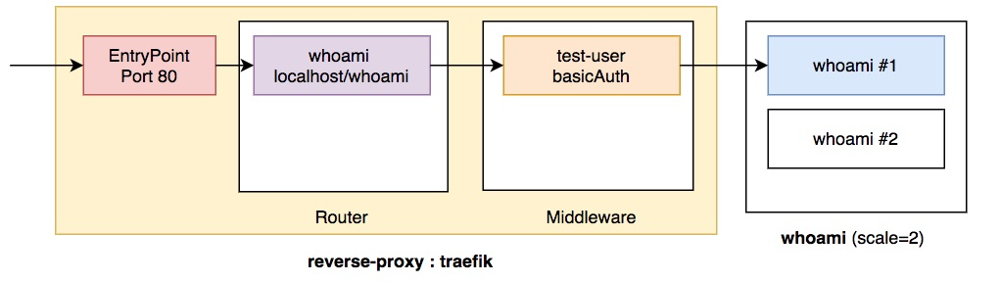
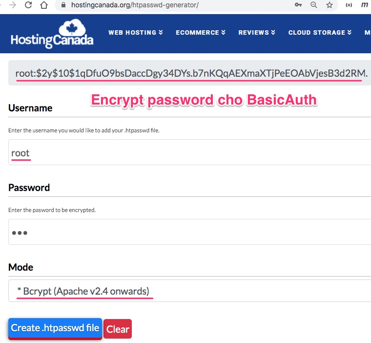
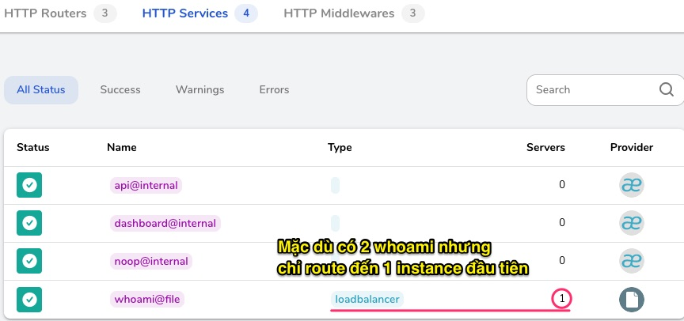

# Traefik cấu hình bằng file

Hỏi: Làm  sao để Traefik có thể định tuyến, chuyển hướng, xử lý được request đến các service phía sau?

Đáp: Traefik cần truy vấn hoặc đọc vào API của các provider. Tiếng Anh ngắn gọn là "Configuration discovery in Traefik is achieved through Providers."

Hỏi: Có những loại provider nào?

Đáp: 
1. Label-based: dùng thẻ label để bổ xung thông tin cấu hình vào từng docker container
2. Key-Value-based: mỗi docker container dùng key-value để lưu cấu hình
3. Annotation-based: đánh dấu
4. File-based: dùng file cấu hình

Bài hôm nay chúng ta học cách dùng File provider hay đơn giản là dùng file để cấu hình.
Thông thường chúng ta dùng 2 file cấu hình:
- [traefik.yml](traefik.yml): file cấu hình lúc traefik khởi động lên.
- [traefik_dynamic.yml](traefik_dynamic.yml): file cấu hình định tuyến các request qua middleware rồi đến các service


## Chạy thử ví dụ này



```
docker-compose up -d
```

Mở trình duyệt mở http://localhost/whoami
nếu thấy dialog yêu cầu đăng nhập gõ:
user: root
pass: abc

Bạn sẽ thấy


## Giải thích docker-compose.yml

[docker-compose.yml](docker-compose.yml)

```yaml
version: '3'

services:
  reverse-proxy:
    image: traefik:v2.5
    ports:      
      - "80:80"
      - "8080:8080"
    volumes:
# map traefik.yml ở thư mục hiện thời ở host vào thư mục / ở container
      - $PWD/traefik.yml:/traefik.yml
# map traefik_dynamic.yml ở thư mục hiện thời ở host vào thư mục / ở container
      - $PWD/traefik_dynamic.yml:/traefik_dynamic.yml

  whoami:
    image: traefik/whoami
```
## traefik.yml

```yml
entryPoints:
  web:
    address: :80

providers:
  file:
    filename: /traefik_dynamic.yml  # Trỏ tới file cấu hình ở thư mục gốc
api:
  insecure: true  # Bật dashboard lên
```

## traefik_dynamic.yml

```yml
# Cấu hình định tuyến
http:
  routers:
    # trỏ đến whoami servide
    to-whoami:
      rule: "Host(`localhost`) && PathPrefix(`/whoami`)"  # Bắt các request http://localhost/whoami
        # If the rule matches, applies the middleware
      middlewares:
        - test-user
      # If the rule matches, forward to the whoami service (declared below)
      service: whoami

  middlewares:
    # Define an authentication mechanism
    test-user:
      basicAuth:
        users:
          - root:$2y$10$Ja5KhDLxe2wqVPL4rOfx..Ep2Iq3NWH0FIYa6urKdlfIEtohSjS2a

  services:
    whoami:
      loadBalancer:
        servers:
          - url: http://whoami  # Mặc dù có 2 service load balance nhưng luôn chỉ chỏ được 1 cái đầu tiên
```

Chuỗi basic authentication được sinh ở web site này https://hostingcanada.org/htpasswd-generator/
```
- root:$2y$10$Ja5KhDLxe2wqVPL4rOfx..Ep2Iq3NWH0FIYa6urKdlfIEtohSjS2a
```



## Đánh giá File Provider

Nhược điểm lớn nhất là mặc dù dịch vụ whoami scale thành 2 instance nhưng cấu hình dưới chỉ route đến 1 instance duy nhất.
Có nghĩa không tận dụng được Load Balancing. Thế mạnh của Traefik 2.x không phải là sử dụng file để cấu hình, mà là khả năng kết nối vào các loại container orchestration để biết được các dịch vụ cần route biến chuyển như thế nào. File cấu hình luôn cứng nhắc không thể theo kịp sự vận động của hệ thống container co dãn. Traefik có thể chậm hơn Nginx hay HA Proxy một chút, nhưng nó hơn ở điểm phối hợp tốt với container orchestration như Docker, Kubernetes.

```yaml
services:
    whoami:
      loadBalancer:
        servers:
          - url: http://whoami
```


