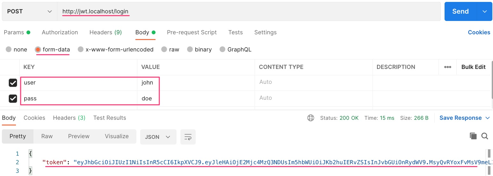
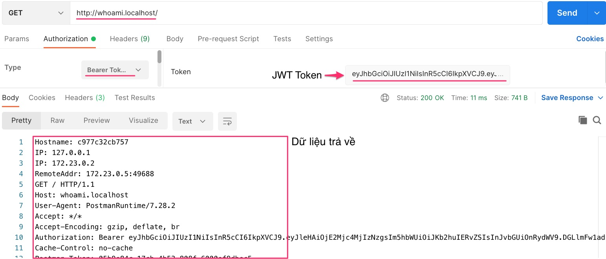

# Traefik Authentication Forwarder


## 1. Chạy thử
Khởi động Docker containers
```
cd ForwardAuth
docker-compose up -d
```
Dùng phần mềm [ctop](https://github.com/bcicen/ctop) để xem các container đang chạy sẽ thấy


### 1.1 Đăng nhập với user/pass = john/doe ở dịch vụ JWT
POST http://jwt.localhost/login


Lấy token trả về sau đăng nhập thành công

### 1.2 Kết nối đến dịch WhoAmI với token có được
GET http://whoami.localhost/

Lấy token từ bước 1. paste vào tab Authorization, chọn kiểu Bearer Token



## Giải thích docker-compose.yml
```yaml
version: '3'

services:
  reverse-proxy:
    image: traefik:v2.5
    command: 
      - --providers.docker  # Kết nối với Docker để lấy thông tin containers thực tế bên trong
      - --api.insecure=true # Bật giao diện dashboard lên

    ports:      
      - "80:80"
      - "8080:8080"
    volumes:
      # Lắng nghe sự kiện từ Docker
      - /var/run/docker.sock:/var/run/docker.sock

  whoami:
    image: traefik/whoami
    labels:
      - "traefik.http.routers.whoami.rule=Host(`whoami.localhost`)" # Hứng các request whoami.localhost vào service này
      - "traefik.http.routers.whoami.middlewares=jwt" # Định nghĩa middle ware trỏ đến service jwt

  jwt:
    build: FiberJWT  # Trỏ đến thư mục chứa mã nguồn để build docker image
    image: jwt:latest # Đặt tên docker image
    scale: 2 # Scale thành 2 instance
    labels:
      - "traefik.http.routers.jwt.rule=Host(`jwt.localhost`)" # Dịch vụ này hứng các request jwt.localhost
      - "traefik.http.middlewares.jwt.forwardauth.address=http://jwt:3000/auth" # Địa chỉ để nhận các request cần xác thực JWT
      - "traefik.http.middlewares.jwt.forwardauth.trustForwardHeader=true" # Forward tất cả header nếu xác thực thành công
      - "traefik.http.middlewares.jwt.forwardauth.authResponseHeaders=X-Forwarded-User"
      - "traefik.http.services.jwt.loadbalancer.server.port=3000" # Cổng load balancer dịch vụ JWT là 3000
```

## Tham khảo

- [Traefik Forward Auth](https://github.com/thomseddon/traefik-forward-auth)
- [Google Oauth Traefik](https://www.smarthomebeginner.com/google-oauth-with-traefik-2-docker/)
