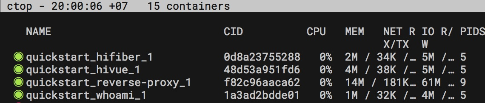

# Lab01: Thực hành Traefik

[Link gốc bài thực hành](https://doc.traefik.io/traefik/v2.2/getting-started/quick-start/)

## Thử ngay

Trong terminal, gõ lệnh 
```
docker-compose up -d
```

## whoami

Để xem hãy gõ http://whoami.localhost

## hifiber
Ứng dụng Golang Fiber lắng nghe ở cổng 3000, trả về chuỗi
`Hi Fiber`

Để xem hãy gõ http://hifiber.localhost

## hivue
Ứng dụng Vue sau khi đã build production và host trong web server nginx, lắng nghe ở cổng 80

Để xem hãy gõ http://hivue.localhost


